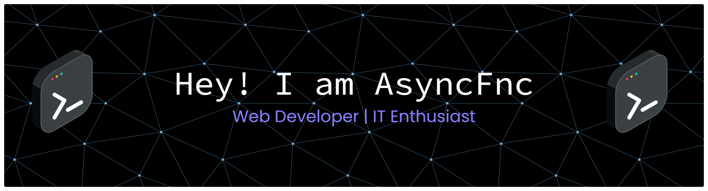

<!--
**jiieea/jiieea** is a ✨ _special_ ✨ repository because its `README.md` (this file) appears on your GitHub profile.

Here are some ideas to get you started:

- 🔭 I’m currently working on ...
- 🌱 I’m currently learning ...
- 👯 I’m looking to collaborate on ...
- 🤔 I’m looking for help with ...
- 💬 Ask me about ...

- 😄 Pronouns: ...
- ⚡ Fun fact: ...
-->

Hello , I'm Async , i am Web Developer and Comp-sci Student.I', interested in Web development , I'm building Both the Front-end Magic and Back-end Power.I work on random project in my spare time.

 ###### Stack I Frequently Use
 

# 💻 Tech Stack:

                  

###### IDE & Text Editor

# 📊 GitHub Stats:
 
 

### 🔝 Top Contributed Repo

---

## 🌐 Socials:
   

###

<picture>
  <source media="(prefers-color-scheme: dark)" srcset="https://raw.githubusercontent.com/jiieea/jiieea/output/pacman-contribution-graph-dark.svg">
  <source media="(prefers-color-scheme: light)" srcset="https://raw.githubusercontent.com/jiieea/jiieea/output/pacman-contribution-graph.svg">
  
</picture>

###

<picture>
  <source media="(prefers-color-scheme: dark)" srcset="https://raw.githubusercontent.com/jiieea/jiieea/output/pacman-contribution-graph-dark.svg">
  <source media="(prefers-color-scheme: light)" srcset="https://raw.githubusercontent.com/jiieea/jiieea/output/pacman-contribution-graph.svg">
  
</picture>

###
